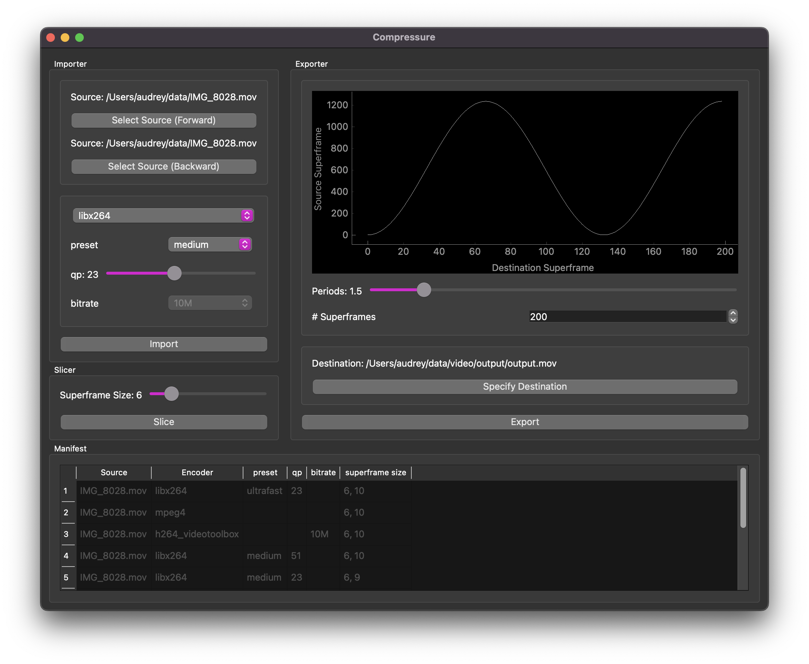

# Overview
Compressure is a tool for video and image creation that hacks the time-dependence
properties of video compression codecs (H.264, MPEG-4, etc.) by manipulating
the frame timeline to break motion-estimation for new forms of movement. Below
is just one example of the kinds of textures and colors we can create using
this tool. For more examples, please see the [Gallery](#gallery) at the bottom
of this README.


# Requirements
First of all, make sure you have `ffmpeg` installed - on MacOS, you can use
`brew install ffmpeg`, and on Debian derivatives you can use `apt-get install ffmpeg`.
You *probably* don't need anything special here, so the builds distributed in
these main channels will suffice.

We strongly recommend using virtual environments. You can use any virtual
environment system you like, but we build and test with `python -m venv
VIRTUAL_ENVIRONMENT_PATH`. Make sure you're using Python 3.7+.

To install, simply activate your venv and run:
```bash
pip install -r requirements.txt
pip install .
```

# Usage
The graphical user interface (GUI) is under active development, so the UI is
subject to change. That being said, it's perhaps the most intuitive and quick
to use. Once you've installed everything on the command line, simply run
`python ui.py`

If you have the cores to spare, specify `--n_workers X`, where `X` is the number of cores to use

Note that you'll need some source videos to run any of these. That's kinda what
this whole project is about. We suggest starting with short videos (10-30
seconds).



## Order of Operations
Compressure is a data processing pipeline over which the user has some control.
The following system diagram may be helpful in understanding how the user's
input affects the process.


Below we explain in greater detail the process outlined above.

### Import Sources
Once you click "import," you may have to wait a moment for the system to import
it. If the system's already encoded a video with a specific setting, it will
cache it and use it later instead of re-encoding

1. select source files:
    1. forward - video used to start, used when moving forward in the timeline
    2. Backward - used when moving backwards through the timeline
2. specify encoder settings:
    1. encoder selection (`mpeg4`, `libx264`, `h264_videotoolbox`) - this is
       perhaps the most impactful choice you can make
    2. encoder options:
        1. preset - dictates encode speed (including size of encodes on disk),
           only available for `libx264`
        2. qp - another important parameter worth playing with, only available
           for `libx264`
        3. bitrate - similar to qp, only relevant for `h264_videotoolbox`
### Slice videos into "superframes"
A "superframe" is a collection of adjacent frames (I like 6-10) which
constitute the smallest unit within the compressure system. This is by far the
longest part of the process and the point at which you can benefit from
multiprocessing. The system will appear to freeze, but if you look over at the
terminal at this time, you'll see it's working hard.

### Export Video
1. Compose with timeline operations - the default operation is a negative cosine:
    1. number of superframes to fit into the timeline - more is a longer film
       with slower motion, high is a shorter film with faster motion
    2. frequency (in $\pi$ radians) from the beginning to the end of the timeline
2. specify destination file

# Development
The following assumes the reader is using MacOS or a Debian derivative and is
relatively familiar with managing their machine. We don't currently support
Windows, and if you use something like CentOS, BSD, or Arch, you can likely
figure out how to translate these commands.

Regarding `ffmpeg`, if you're trying to do hardware acceleration, we suggest
trying the builds distributed through the main package manager channels first,
then install from source if necessary. Note that the `ffmpeg` developers
recommend installing from source code, but that process is out of scope for
this document.

## Make & Docker
The easiest thing to do is simply install with Make and Docker:
```bash
make build
make run
```

Note that the above will first build the docker container using `Dockerfile`
and then run that image using the mountpoints specified in `Makefile`, and
execute the shell script `sample_compressure_command.sh`. Because it uses
sample values for video filenames, you should see a `SubprocessError`
indicating that a video file couldn't be found. To get around this, you should:
1. locate one or two videos you're interested in using (suggested length >10sec
   and <5min), place somewhere on your filesystem to expose to the Docker
   container
2. in `sample_compressure_command.sh`, change the values of
   `FNAME_VIDEO_FORWARD` and `FNAME_VIDEO_BACKWARD` to match those of the one
   or two videos you selected above
3. in `Makefile`, change the value of `DPATH_INPUT` to be the parent directory
   of the one or two videos you selected above
4. **Optionally** in `Makefile`, change the value of `DPATH_OUTPUT` to a preferred location
5. Build and run the docker container with `make run`


## Directly
If you're trying to use the system directly or interactively, the easiest
entrypoint is `main.py`. You can run this in an interactive Python session (we
prefer IPython), or straight from the command line.

### Note about Default Values
Compressure defaults to filesystem locations, encoding schemes, and
hyperparameters that are supposed to be understandable, interesting, and fast.
In general, we try to keep default parameters in a simple class within the
module in which they're relevant, with class names like
`VideoPersistenceDefaults` and `VideoCompressionDefaults`. This may change at
some point. Below are some examples:
- cached files (including the manifest file, a JSON file that keeps track of
  cached files) go to `~/.cache/compressure` unless specified otherwise
- encoded videos are dropped into the `$CACHE/encodes` by default, where `$CACHE` is the location specified above.
- videos are encoded with `libx264` unless specified otherwise
- encoding parameters (listed below as ffmpeg commands:
    - `-c:v libx264 -preset veryfast -qp -1 -bf 0`:
        - `libx264` is the default codec for [H.264 in FFmpeg](https://trac.ffmpeg.org/wiki/Encode/H.264).
        - `-preset` is a [coarse setting that loosely governs the trade-off between encode speed and compression efficiency](https://trac.ffmpeg.org/wiki/Encode/H.264#Preset)
        - `-qp` is the [quantization parameter](https://slhck.info/video/2017/03/01/rate-control.html), which governs how fine the details are. Changing this has a large impact on the end results
        - `-bf` is the max number of [bidirectional interframes (or B-frames)](https://en.wikipedia.org/wiki/Inter_frame#B-frame). We usually set this to 0 to avoid stuttering.
    - `-c:v mpeg4`
    - `-c:v h264_videotoolbox -bf 0 -b:v 10M`:
        - `h264_videotoolbox` is the [MacOS hardware-accelerated codec for H.264](https://developer.apple.com/documentation/videotoolbox). In our experiments with it in this context, it's not particularly impactful
        - `-b:v` is the target bitrate, which we specify as `bitrate` in Python for readability
    - GoP size is the "group of pictures" size, specifying the maximum number
      of frames to place between intra-frames. Lower numbers will "reset" the
      video to a normal-looking state more frequently, higher numbers will
      propagate artifacts for longer (more abstract). This corresponds to the
      ffmpeg option `-g`
- Encoded videos later get sliced into "superframes" - very short (4-10 frames)
  chunks that are each offset by one second w.r.t. their temporal neighbors. We
  can move through the timeline one superframe at a time, to see a kind of
  quantized (in the sense of atomic packets, not necessarily discretized)
  motion. We find that `superframe_size` is best tweaked differently for each
  asset, based on how much motion is captured in the video, as well as the
  inherent framerate of the video. We usually start with 6, since it's a factor
  of 24, 30, and 60 (three common framerates for video). A superframe size of 6
  will yield slices of 0.25 seconds, 0.2 seconds, and 0.1 seconds respectively.
  Superframe size does NOT need to be a factor of framerate, though we think
  the result looks best when it's less than 0.5 seconds.


### Note about persistent caching
The compressure system makes extensive use of persistent caching to avoid
redunant encoding and slicing operations. By default, these are kept in
`~/.cache/compressure` and tracked in `~/.cache/compressure/manifest.json`.

The `compressure.persistence.CompressurePersistence` class is the object we use
for tracking all these versions. Unfortunately, the manifest doesn't
automatically scan the persistence directory at startup, so any versions
deleted outside the Compressure app won't be reflected in the manifest. The
best way to add or remove entries to the persistent cache is to use the
persistence object referenced at the top of this paragraph.

You can manually set the persistence directory by specifying `fpath_manifest`
and `workdir` when instantiating the `compressure.main.CompressureSystem`
object. There is currently no command-line support for this operation.


### Interactive Python Session
This is the "manual" mode that gives you the most control and responsibility. It is the preferred mode of development. The specifics will be different based on your system, but it likely will look something like this:

#### Using Default values
```python
from compressure.main import CompressureSystem
controller = CompressureSystem()

# Forward and backward videos - could be different sources entirely!
fpath_source_fwd = "~/data/video/input/blooming-4.mov"
fpath_source_back = "~/data/video/input/blooming-4_reverse.mov"

# Encode both - may replace all references to "compression" with "encoding"
fpath_encode_fwd = controller.compress(fpath_source_fwd)
fpath_encode_back = controller.compress(fpath_source_back)

dpath_slices_fwd = controller.slice(
    fpath_source=fpath_source_fwd,
    fpath_encode=fpath_encode_fwd,
    superframe_size=6,
)
dpath_slices_back = controller.slice(
    fpath_source=fpath_source_back,
    fpath_encode=fpath_encode_back,
    superframe_size=6,
)

# Create "buffer" of all superframes, for scrubbing through the timeline by superframes
buffer = controller.init_buffer(dpath_slices_fwd, dpath_slices_back, superframe_size=6)

# Generate a timeline function, establishing how we're moving through the timeline.
# TODO we want this to be controlled live, rather than a predefined function like so
timeline = generate_timeline_function(6, len(buffer), frequency=0.5, n_superframes=100)

# Now use the timeline to step/traverse through the video buffer
video_list = [deepcopy(buffer.state)]
for loc in timeline:
    video_list.append(buffer.step(to=loc))

# Finally, concatenate the videos!
concat_videos(video_list, fpath_out="~/data/video/output/output.mov")
```

We don't currently have a more tightly-integrated traversal tool, because we're
hoping to replace it with something more playable. Unfortunately, this means
we're not putting much energy into tightening-up the traversal


#### Using Custom Values
```python
from compressure.main import CompressureSystem, generate_timeline_function
from compressure.dataproc import concat_videos
from copy import deepcopy

# Instantiate the controller (including persistent caching, encoding, slicing)
controller = CompressureSystem(fpath_manifest, workdir, verbosity)

# Forward and backward videos - could be different sources entirely!
fpath_source_fwd = "~/data/video/input/blooming-4.mov"
fpath_source_back = "~/data/video/input/blooming-4_reverse.mov"

# Encode both - may replace all references to "compression" with "encoding"
fpath_encode_fwd = controller.compress(
    fpath_source_fwd,
    gop_size=6000,
    encoder='libx264',
    encoder_config={
        'preset': 'veryslow',
        'qp': 31,
        'bf': 0,
    },
)
fpath_encode_back = controller.compress(
    fpath_source_back,
    gop_size=6000,
    encoder='libx264',
    encoder_config={
        'preset': 'veryslow',
        'qp': 31,
        'bf': 0,
    },
)

# Slice both into "superframes" - very short (4-10 frames) video files,
# each offset by one frame with respect to its neighbors 
dpath_slices_fwd = controller.slice(
    fpath_source=fpath_source_fwd,
    fpath_encode=fpath_encode_fwd,
    superframe_size=6,
)
dpath_slices_back = controller.slice(
    fpath_source=fpath_source_back,
    fpath_encode=fpath_encode_back,
    superframe_size=6,
)

# Create "buffer" of all superframes, for scrubbing through the timeline by superframes
buffer = controller.init_buffer(dpath_slices_fwd, dpath_slices_back, superframe_size=6)

# Generate a timeline function, establishing how we're moving through the timeline.
# TODO we want this to be controlled live, rather than a predefined function like so
timeline = generate_timeline_function(6, len(buffer), frequency=0.5, n_superframes=100)

# Now use the timeline to step through the video buffer
video_list = [deepcopy(buffer.state)]
for loc in timeline:
    video_list.append(buffer.step(to=loc))

# Finally, concatenate the videos!
concat_videos(video_list, fpath_out="~/data/video/output/output.mov")
```

This is where it starts to become an interesting experiment. We recommend playing around with this - use different presets, codecs, qp values, bitrates, superframe sizes, timeline functions, etc.!

Once we have a GUI and support live video creation, the experimentation process will be much faster!

### Command Line
```bash
python main.py \
  -f ~/data/video/input/blooming-4.mov \
  -b ~/data/video/input/blooming-4_reverse.mov \
  -g 6000 \
  --encoder libx264 \
  --encoder_config preset veryslow qp 31 bf 0 \
  --superframe_size 6 \
  --frequency 0.5 \
  --n_superframes 100 \
  -o ~/data/video/output/output.mov
```

The above will do exactly what we're doing above, from the command line. This may be the fastest way of interacting with it

# Experimental Results
TODO
## The simplest way of explaining what's happening  
Video compression codecs take advantage of both spatial and temporal
redundancies, to encode images and motion by referencing other parts of the
image or timeline. Let's start with images, then move to the video domain:

Images are composed of high-frequency components (quickly changing colors or
light intensity in space) and low-frequency components (solid blocks of color
or light). A fine checkerboard, detailed hair or fur, and the texture of leaves
on a tree from afar, are all  examples of high-frequency spatial data. A clear
sky or a single-color shirt are examples of low-frequency spatial data.
Low-frequency spatial data can be encoded much more efficiently than
high-frequency data, because it's less costly to say "take this color and apply
it to this whole area" than to encode individual pixels (or represent an
arbitrarily complex function). The specifics of this are somewhat more complex,
but this simplification will do just fine for now.

Videos are obviously composed of images, so image compression ideas come into
play here as well. However, since videos have a temporal component to them, we
can exploit redundancies there too. A fast-paced image sequence, where subjects 
appear and disappear quickly, requires encoding whole sections of images from
scratch. But if motion is small, or gradual, or non-existent, then we may
encode a frame as "the same as the last frame, with these pixels moving in this
direction," which is much more efficient. The simplest (though impractical for
several reasons) implementation involves encoding only the first image in a
sequence, then encoding the rest as a modification on the first. This creates a
cascading chain of dependencies, where each frame is derivative of previous
frames. We'll discuss the impracticalities of this particular implementation
later, but its close enough to continue the conversation now.

With each of these models of compression, we encode a few components:
- Approximation of spatial or temporal function
  - e.g. 2D function over image patch, or back-references to previous frames
- Error or residual term, applied to the approximation to correct it for this
  particular data

The question that Compressure answers is "what happens if you interrupt this
chain of temporal dependencies?" If we skip frames, or duplicate frames,
without adjusting the motion or residual estimation, we introduce artifacts
that cascade through the image sequence, producing unexpected and unique
videos. Compressure does this by encoding a source video according to
user-defined parameters, slicing the compressed video it into "superframes," or
short collections of consecutive frames (1-10 frames, for instance), then
moving through the timeline of superframes in a way that repeats or skips
superframes, introducing artifacts and slowing or speeding-up movement.

## How we exploit video encoding to yield interesting results 
We mentioned above that we encode videos using references to previous frames,
with the first frame in the video as the terminal frame. In the parlance of
video compression, we're talking about I-frames a P-frames. P-frames are those
which are encoded as derivatives of previous frames and itself as much as
possible, while I-frames are those which are not encoded with any temporal
dependencies. Modern video codecs also make use of B-frames (for bidirectional
temporal dependencies), but we don't often use them in Compressure because they
tend to manifest as stuttering which we find undesireable.

In most use-cases, videos are encoded such that every ten frames or so is an
I-frame, the justification being that they seek to minimize distortion (from
approximating motion and residuals) and allow random access to different parts
of the film. In codec world, this equates to a "group of pictures (gop) size)"
of 10 (give or take). This yields the benefits above, but we eschew this in
order to produce interesting artifacts. In our case, we set the `gop_size` to
some absurdly large number, such that we never refresh the video feed with an
I-frame, allowing artifacts to propagate. This technique actually comes from an
artistic practice called "data moshing," which is how the Compressure project
started.

Datamoshing usually involves taking two or more videos, removing the I-frames
of the second, and concatenating it with the first to produce motion from the
second, on top of imagery from the first. We diverge from the standard
datamoshing practice by taking a single video and slicing it into *many*
shorter videos, selecting a subset of them, and concatenating them again. The
artifacting comes from moving through the video timeline (one slice at a time)
at a faster or slower rate. To illustrate the slicing and traversal project, we've made a few small diagrams illustrating it:

Standard Video, 30 frames long
```
start                        end
<---------------------------->
```


26 Sliced videos, each 5 frames long
```
 0 <--->
 1  <--->
 2   <--->
 3    <--->
 4     <--->
 5      <--->
 6       <--->
 7        <--->
 8         <--->
 9          <--->
10           <--->
11            <--->
12             <--->
13              <--->
14               <--->
15                <--->
16                 <--->
17                  <--->
18                   <--->
19                    <--->
20                     <--->
21                      <--->
22                       <--->
23                        <--->
24                         <--->
25                          <--->
```

Moving through timeline (via slices) at standard speed, yielding no (or minimal) artifacting
```
 0 <--->
 5      <--->
10           <--->
15                <--->
20                     <--->
25                          <--->
```

```
Moving through timeline (via slices) at 140% speed, yielding some artifacts, faster motion, and a shorter video
 0 <--->
 7        <--->
14               <--->
21                      <--->
```

Moving through timeline (via slices) at 60% speed, yielding some artifacts, slower motion, and a longer video
```
 0 <--->
 3    <--->
 6       <--->
 9          <--->
12             <--->
15                <--->
18                   <--->
21                      <--->
24                         <--->
```

Moving through timeline (via slices) at standard speed, then reversing, yielding no (or minimal) artifacting (if we supplied a reversed video as input as well)
```
 0 <--->
 5      <--->
10           <--->
15                <--->
20                     <--->
25                          <--->
20                     <--->
15                <--->
10           <--->
 5      <--->
 0 <--->
```

As we can see above, each slice is offset by 1 frame w.r.t. its neighbors, so we can grab any slice we want. If we want to reproduce the source exactly, we simply grab each non-overlapping slice, and the output is the same length of the input. Skipping parts of the source between each concatenated slice yields faster motion (shorter video if we don't repeat) and repeating frames by selecting overlapping slices yields slower motion (longer video if we move through the whole timeline linearly).

Of course this begs the question: "what if we arbitrarily move through the timeline?" That's what we're exploring here! We currently use a function that generates a timeline according to a sinusoid. You can try this yourself following the instructions of a later section.

You'll find, as you play around with different codecs (sometimes called `encoder`s in this project), and codec parameters (`encoder_config`), that different codecs produce wildly different artifacts, and tweaking various codec parameters can result in unexpected changes in the finished product. In a later section, we'll discuss some of our findings.

### Using nonlinear timeline functions
The timeline function we've currently implemented is a rectified sine wave, with variable frequency. The way we implement that is by generating a discrete sine function, scale it to the total number of slices, and use that to index a slice. For example, here's some simple code that uses the values we established above:
```python
>>> from compressure.main import generate_timeline_function
>>> generate_timeline_function(
...     superframe_size=5,
...     len_lvb=26, 
...     n_superframes=6,
...     frequency=0.5
...     )
array([ 0, 14, 23, 23, 14, 0 ])
```
The above timeline function corresponds to the following video ordering:
```
 0 <--->
14               <--->
23                        <--->
23                        <--->
14               <--->
 0 <--->
```

Another example:
```python
>>> generate_timeline_function(
...     superframe_size=5,
...     len_lvb=26,
...     n_superframes=13,
...     frequency=1
...     )
array([ 0, 12, 21, 25, 21, 12, 0, 12, 21, 25, 21, 12, 0 ])
```
which corresponds to 
```
 0 <--->
12             <--->
21                      <--->
25                          <--->
21                      <--->
12             <--->
 0 <--->
12             <--->
21                      <--->
25                          <--->
21                      <--->
12             <--->
 0 <--->
```
Finally, here's an example with higher resolution:
```python
>>> generate_timeline_function(
...     superframe_size=5,
...     len_lvb=26,
...     n_superframes=21,
...     frequency=0.5
...     )
array([ 0, 3, 7, 11, 14, 17, 20, 22, 23, 24, 25, 24, 23, 22, 20, 17, 14, 11, 7, 3, 0 ])
```
and the visual representation:
```
 0 <--->
 3    <--->
 7        <--->
11            <--->
14               <--->
17                  <--->
20                     <--->
22                       <--->
23                        <--->
24                         <--->
25                          <--->
24                         <--->
23                        <--->
22                       <--->
20                     <--->
17                  <--->
14               <--->
11            <--->
 7        <--->
 3    <--->
 0 <--->
```

You can see from the above that the selection of this function is designed to show off the variable speed and directionality afforded by the compressure system.

# Gallery

[bl/lo/oo/om, a piece by mip using only Compressure with four different settings on the same source](https://vimeo.com/839952288)


[dissociation v2, a piece by mip using only Compressure on a single source](https://vimeo.com/795867057)


[descendence, a piece by mip using only Compressure on a single source](https://vimeo.com/839952065)
